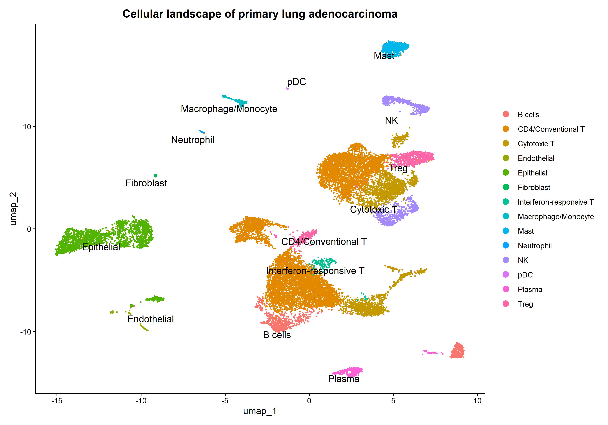
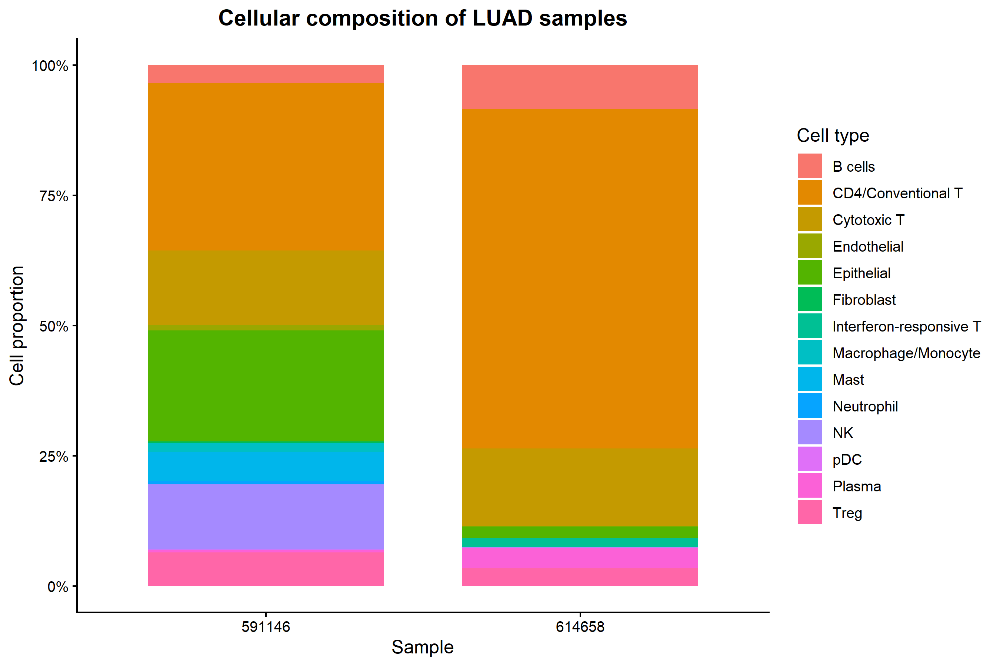
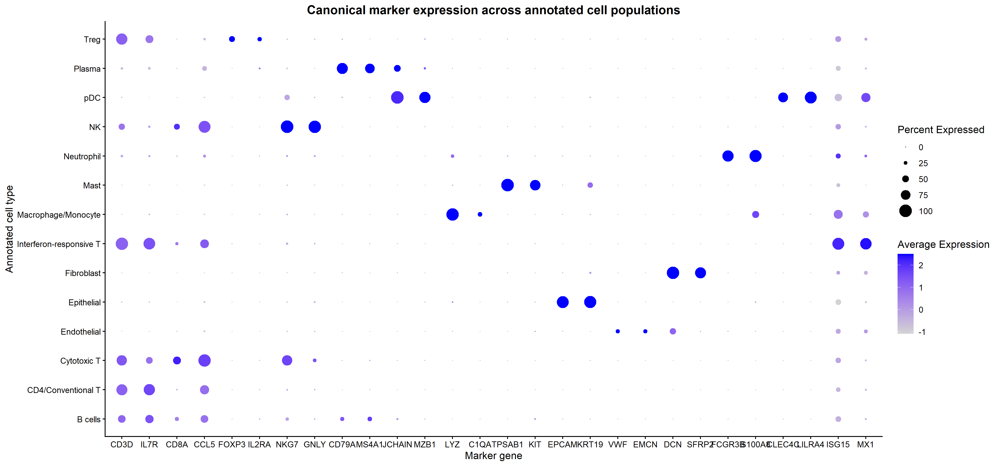
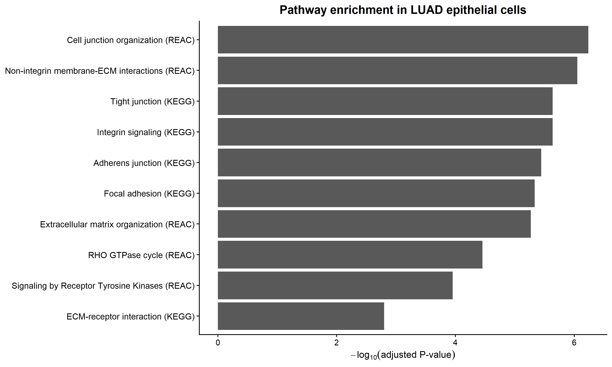
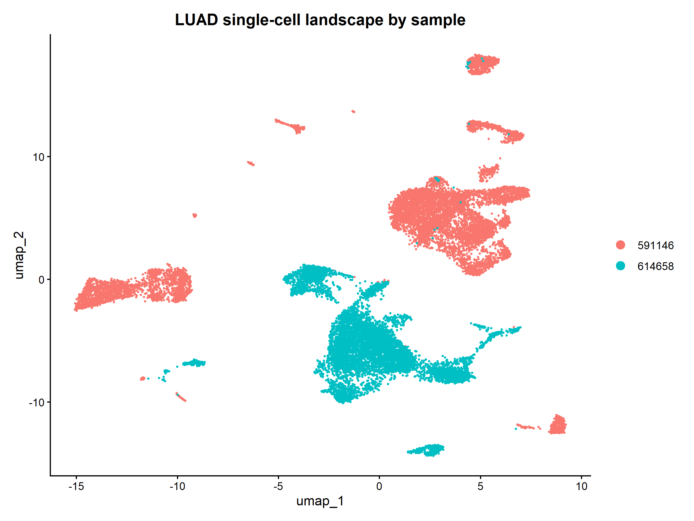

# Single-Cell Transcriptomic Characterisation of Human Lung Adenocarcinoma

A reproducible single-cell RNA-seq analysis of two primary human lung adenocarcinoma (LUAD) specimens from **GEO GSE164983**, implemented in R with Seurat.

This project demonstrates an end-to-end scRNA-seq workflow spanning quality control, sample-wise doublet detection, normalization, dimensionality reduction, unsupervised clustering, marker-guided cell-type annotation, cellular-composition analysis, epithelial-associated gene analysis, and functional pathway enrichment.

## Biological question

**What cellular populations and transcriptional programmes characterise the tumour microenvironment of primary human lung adenocarcinoma, and what biologically relevant pathways can be identified from single-cell RNA sequencing?**

## Dataset

- **GEO accession:** GSE164983
- **Samples:** 2 primary human LUAD specimens
- **Technology:** 10x Genomics Chromium Single Cell 3'
- **Input:** processed filtered feature-barcode H5 matrices
- **Reference:** GRCh38

Raw sequencing files are not required. Download the two processed `filtered_feature_bc_matrix.h5` files from GEO and place them in a local `data/` directory.

## Analysis workflow

```text
Processed 10x matrices
        |
        v
22,323 cells
        |
        v
Quality control
300 <= detected genes <= 6,000
mitochondrial RNA <= 20%
        |
        v
21,926 QC-passed cells
        |
        v
Sample-wise scDblFinder
2,517 predicted doublets removed
        |
        v
19,409 singlets
        |
        v
Log normalization + 2,000 HVGs
        |
        v
PCA -> neighbour graph -> clustering -> UMAP
        |
        v
Marker-guided cell-type annotation
        |
        v
Cellular composition
        |
        v
Epithelial-associated marker analysis
        |
        v
GO / Reactome / KEGG enrichment
```

## Key results

### 1. Quality control and doublet removal

The dataset contained **22,323 cells** before QC. Dataset-informed filtering retained **21,926 cells (98.2%)**. Doublets were detected independently within each 10x capture using scDblFinder: approximately **13.4%** in sample 591146 and **9.0%** in sample 614658. After doublet removal, **19,409 singlets** were retained for downstream analysis.

Supporting QC plots are available in the [figures](figures/) directory.

### 2. Cellular landscape

Marker-guided annotation resolved immune, epithelial and stromal populations including CD4/conventional T cells, cytotoxic T cells, Tregs, interferon-responsive T cells, NK cells, B/plasma cells, macrophage/monocyte cells, mast cells, neutrophils, pDCs, epithelial cells, endothelial cells and fibroblasts.



### 3. Inter-tumour cellular heterogeneity

The two specimens displayed markedly different cellular compositions. Sample 591146 contained a more heterogeneous mixture with appreciable epithelial, cytotoxic T, NK and mast-cell populations. Sample 614658 was predominantly CD4/conventional T cells and also contained a distinct interferon-responsive T-cell population.

These differences are **descriptive observations from two specimens**, not population-level estimates.



### 4. Marker-based annotation validation

Canonical lineage markers supported the broad annotations, including T-cell, cytotoxic/NK, B/plasma, myeloid, mast, epithelial, endothelial and fibroblast populations. The interferon-responsive population showed T-lineage markers together with an interferon-stimulated expression programme.



### 5. Epithelial-associated transcriptional programme

Comparison of annotated epithelial cells with all other annotated populations identified **1,880 epithelial-associated marker genes**. Prominent genes included `EHF`, `CXCL17`, `TFF3`, `CEACAM6`, `PIGR`, `ITGB6`, `SLC6A14` and `BPIFB1`.

Functional enrichment highlighted convergent biological themes involving:

- cell-junction organisation
- extracellular-matrix organisation and ECM-receptor interactions
- integrin and focal-adhesion signalling
- tight and adherens junctions
- RHO-family GTPase signalling
- receptor tyrosine kinase signalling



The enrichment analysis describes pathways associated with epithelial cells **relative to the other cell populations in this dataset**. It should not be interpreted as tumour-versus-normal pathway activation.

## Analysis decisions

### Why integration was not forced

PCA and UMAP showed substantial sample-associated structure. With only two patients, technical sample effects and genuine inter-patient biology cannot be reliably disentangled. The primary analysis therefore preserves the unintegrated structure rather than automatically applying Harmony/CCA and potentially removing biological variation.

The sample-level UMAP is retained as part of the analytical record:



### Why epithelial cells are not labelled malignant

The dataset does not contain matched normal controls, and epithelial identity alone does not establish malignancy. The cells are therefore conservatively described as **epithelial**. Additional evidence, such as copy-number inference with an appropriate reference population, would be required to support malignant-cell classification.

## Repository structure

```text
GSE164983-LUAD-scRNAseq/
├── R/
│   ├── 01_load_data.R
│   ├── 02_quality_control.R
│   ├── 03_doublet_detection.R
│   ├── 04_normalization_clustering.R
│   ├── 05_cell_type_annotation.R
│   ├── 06_epithelial_analysis.R
│   └── 07_pathway_enrichment.R
├── data/       # GEO H5 files; excluded from Git
├── figures/    # QC and analysis figures
├── results/    # Lightweight result tables
├── .gitignore
└── README.md
```

## Reproducing the analysis

Run the scripts sequentially from the repository root:

```text
R/01_load_data.R
R/02_quality_control.R
R/03_doublet_detection.R
R/04_normalization_clustering.R
R/05_cell_type_annotation.R
R/06_epithelial_analysis.R
R/07_pathway_enrichment.R
```

Main R packages: **Seurat**, **SingleCellExperiment**, **scDblFinder**, **gprofiler2**, **dplyr**, **ggplot2**, **patchwork**, and **hdf5r**.

## Limitations

This is an exploratory analysis of **two LUAD specimens**, not a population-level cohort study. Sample identity is confounded with patient-specific biology and potential technical effects. Accordingly, between-sample differences are interpreted descriptively rather than as generalisable LUAD effects.

There are no matched normal controls, so the epithelial marker and enrichment analyses are not tumour-versus-normal comparisons. No population-level differential-expression inference is made from the two specimens.

## Skills demonstrated

**Single-cell RNA sequencing · Seurat · scDblFinder · QC · PCA · UMAP · unsupervised clustering · marker-based cell annotation · differential marker analysis · functional enrichment · GO · Reactome · KEGG · g:Profiler · R · reproducible analysis · Git/GitHub**

## Data availability

The source data are publicly available through **NCBI Gene Expression Omnibus (GSE164983)**. Large source files and intermediate Seurat `.rds` objects are intentionally excluded from this repository.
